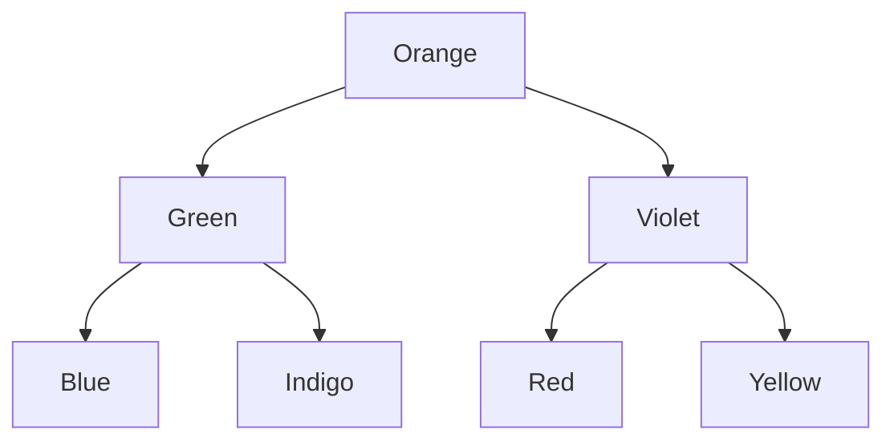

# Why do BSTs exist?
1. Hash table allow const search, insert, del O(1)
2. But do not allow insertions and deletions easily
3. What as needed was a data struct that allows fast search + fast insert/del.
4. 'fast' here means faster than 'n'.  

## Uses of BST
- Priority Queues
- Quicksort
- Tree Sort
- In Btrees for fast indexed search on Primary Storage

## Things to remember about BST
- inorder traversal of BST produces ascending order
- if balanced all ops can be O(logn)
- types of balanced BST
  - AVL
  - RB Tree
  - Splay Tree
  - T-tree, treap, 2-3 tree, B-tree
  
PS: 
All deletes implicitly involve search as well.
```
UnsortedArr : Search:   O(n), insert:     O(1), del:    O(n+n) : +ve: very fast ins O(1)    , -ve:  slow search/del O(n)
SortedArr   : Search:O(logn), insert:O(logn+n), del: O(logn+n) : +ve: faster search O(logn) , -ve:  slow search/del O(n)
UnsortedList: Search:   O(n), insert:     O(1), del:      O(n) : +ve: very fast ins O(1)    , -ve:  slow search/del O(n)
SortedList  : Search:   O(n), insert:   O(n+1), del:    O(n+1) : +ve:                  -    , -ve:  slow search/ins/del O(n)
Hash        : ?
Balanced BST: Search:O(logn), insert:  O(logn), del:   O(logn) : +ve: moderate search/in/del, -ve:  moderate slow 
```
So BSTs do all ops in O(logn) 

# Qs
1. Why use a Bal BST over Hash ?
 - Binary Search Trees are generally memory-efficient since they do not reserve more memory than they need to.
 - On the other hand, Hash tables can be a bit more demanding if we don't know the exact number of elements we want to store.
 - In BST we can do range searches efficiently but in Hash Table we cannot do range search efficienly.

https://www.baeldung.com/cs/hash-table-vs-balanced-binary-tree

https://www.baeldung.com/cs/binary-trees-vs-linked-lists-vs-hash-tables

https://www.geeksforgeeks.org/advantages-of-bst-over-hash-table

2. When to use a Bal BST ?
- When both search / modify ops need to be fast and mem efficient.
- When only search needs to be fast, and num of keys are rel fixed, can use Hash.

So BST slower than sortedArr in search but faster than Sorted at ins/del but   
Datastruct | SortedList| UnsortedList      | comments
---------- | --------- | ----------------- | ------|
search     | O(n)      | O(n)              | 
insert     | O(n)      | O(1)              |
delete     | O(n)      | O(n)              |

Primitive Data structs to store data include arrays and lists.
Datastruct | SortedArr | SortedLinkedlists | comments
---------- | --------- | ----------------- | ------|
search     | O(logn)   | O(n)              | 
insert     | O(n)      | O(n)              |
delete     | O(n)      | O(n)              |


# Example
Arranged Alphabetically not VIBGYOR
```
Blue Green Indigo Orange Red Violet Yellow
```



# Related Reading
