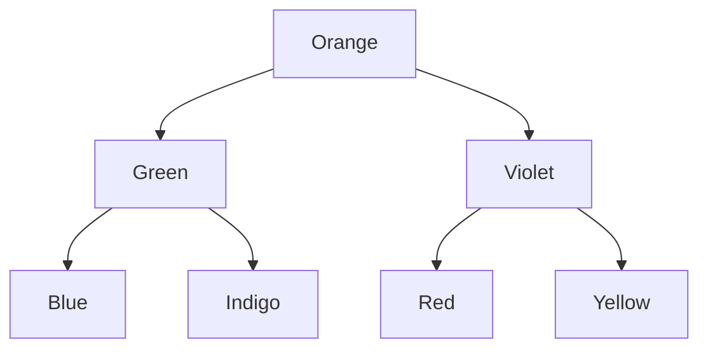

# Why do BSTs exist?
1. Hash table allow const search, insert, del O(1)
2. But do not allow insertions and deletions easily
3. What as needed was a data struct that allows fast search + fast insert/del.
4. 'fast' here means faster than 'n'.  

## Uses of BST
- Priority Queues
- Quicksort
- Tree Sort
- In Btrees for fast indexed search on Primary Storage

## Things to remember about BST


- inorder traversal of BST produces ascending order
- Successor = "after node", i.e. the next node, or the smallest node after the current one.
  - It's also the next node in the inorder traversal. To find a successor, go to the right once and then as many times to the left as you could.
  ```
  # One step right and then always left
  def successor(root: TreeNode) -> TreeNode:
    root = root.right
    while root.left:
        root = root.left
    return root
    ```
- Predecessor = "before node", i.e. the previous node, or the largest node before the current one.
  - It's also the previous node in the inorder traversal. To find a predecessor, go to the left once and then as many times to the right as you could.
  ```
  # One step left and then always right
  def predecessor(root: TreeNode) -> TreeNode:
    root = root.left
    while root.right:
        root = root.right
    return root
  ```
- Deleting a node
  - Cases
    - case 1 : empty tree: nothing to del        
    - case 2: leaf node: just del it
    

    - case 3: non-leaf/nested node,with only right child
    

      - replace with its successor
      - proceed down recursively to delete the successor.
          
    - case 4: non-leaf/nested node,with only left child
    

      - means that its successor is somewhere upper in the tree but we don't want to go back.
      - Let's use the predecessor here which is somewhere lower in the left subtree. 
      - The node could be replaced by its predecessor and then one could proceed down recursively to delete the predecessor.      

  - Algorithm
    - If key > root.val then delete the node to delete is in the right subtree root.right = deleteNode(root.right, key).
    - If key < root.val then delete the node to delete is in the left subtree root.left = deleteNode(root.left, key).
    - If key == root.val then the node to delete is right here. Let's do it :
      - If the node is a leaf, the delete process is straightforward : root = null.
      - If the node is not a leaf and has the right child, then replace the node value by a successor value root.val = successor.val, and then recursively delete the successor in the right subtree root.right = deleteNode(root.right, root.val).
      - If the node is not a leaf and has only the left child, then replace the node value by a predecessor value root.val = predecessor.val, and then recursively delete the predecessor in the left subtree root.left = deleteNode(root.left, root.val).
    - Return root.
  - code
  ```
  class Solution:
    # One step right and then always left
    def successor(self, root: TreeNode) -> int:
            root = root.right
            while root.left:
                root = root.left
            return root.val
        
    # One step left and then always right
    def predecessor(self, root: TreeNode) -> int:
        root = root.left
        while root.right:
            root = root.right
        return root.val

    def deleteNode(self, root: TreeNode, key: int) -> TreeNode:
        if not root:
            return None

        # delete from the right subtree
        if key > root.val:
            root.right = self.deleteNode(root.right, key)
        # delete from the left subtree
        elif key < root.val:
            root.left = self.deleteNode(root.left, key)
        # delete the current node
        else:
            # the node is a leaf
            if not (root.left or root.right):
                root = None
            # the node is not a leaf and has a right child
            elif root.right:
                root.val = self.successor(root)
                root.right = self.deleteNode(root.right, root.val)
            # the node is not a leaf, has no right child, and has a left child    
            else:
                root.val = self.predecessor(root)
                root.left = self.deleteNode(root.left, root.val)
                        
        return root
  ```
- if balanced all ops can be O(logn)
- types of balanced BST
  - AVL
  - RB Tree
  - Splay Tree
  - T-tree, treap, 2-3 tree, B-tree
  
PS: 
All deletes implicitly involve search as well.
```
UnsortedArr : Search:   O(n), insert:     O(1), del:    O(n+n) : +ve: very fast ins O(1)    , -ve:  slow search/del O(n)
SortedArr   : Search:O(logn), insert:O(logn+n), del: O(logn+n) : +ve: faster search O(logn) , -ve:  slow search/del O(n)
UnsortedList: Search:   O(n), insert:     O(1), del:      O(n) : +ve: very fast ins O(1)    , -ve:  slow search/del O(n)
SortedList  : Search:   O(n), insert:   O(n+1), del:    O(n+1) : +ve:                  -    , -ve:  slow search/ins/del O(n)
Hash        : ?
Balanced BST: Search:O(logn), insert:  O(logn), del:   O(logn) : +ve: moderate search/in/del, -ve:  moderate slow 
```
So BSTs do all ops in O(logn) 

# Qs
1. Why use a Bal BST over Hash ?
 - Binary Search Trees are generally memory-efficient since they do not reserve more memory than they need to.
 - On the other hand, Hash tables can be a bit more demanding if we don't know the exact number of elements we want to store.
 - In BST we can do range searches efficiently but in Hash Table we cannot do range search efficienly.

https://www.baeldung.com/cs/hash-table-vs-balanced-binary-tree

https://www.baeldung.com/cs/binary-trees-vs-linked-lists-vs-hash-tables

https://www.geeksforgeeks.org/advantages-of-bst-over-hash-table

2. When to use a Bal BST ?
- When both search / modify ops need to be fast and mem efficient.
- When only search needs to be fast, and num of keys are rel fixed, can use Hash.

So BST slower than sortedArr in search but faster than Sorted at ins/del but   
Datastruct | SortedList| UnsortedList      | comments
---------- | --------- | ----------------- | ------|
search     | O(n)      | O(n)              | 
insert     | O(n)      | O(1)              |
delete     | O(n)      | O(n)              |

Primitive Data structs to store data include arrays and lists.
Datastruct | SortedArr | SortedLinkedlists | comments
---------- | --------- | ----------------- | ------|
search     | O(logn)   | O(n)              | 
insert     | O(n)      | O(n)              |
delete     | O(n)      | O(n)              |


# Example
Arranged Alphabetically not VIBGYOR
```
Blue Green Indigo Orange Red Violet Yellow
```


# Practice Probs
- https://leetcode.com/problems/convert-sorted-array-to-binary-search-tree/

# Related Reading
