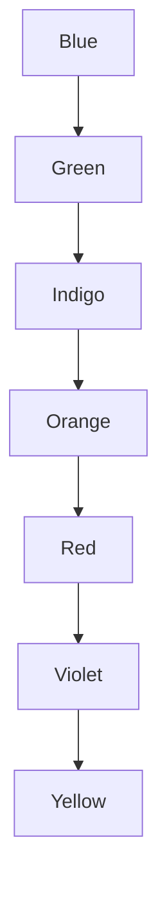
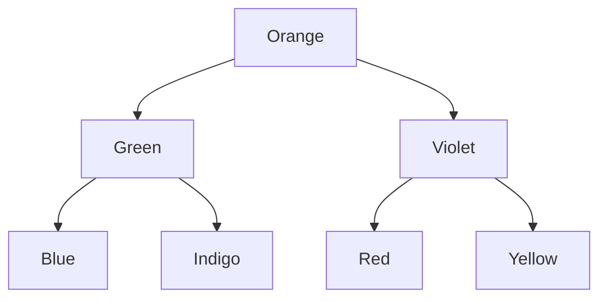

# Why do BSTs exist?
1. Hash table allow const search, insert, del O(1)

Datastruct | SortedList| UnsortedList      | comments
---------- | --------- | ----------------- | ------|
search     | O(n)      | O(n)              | 
insert     | O(n)      | O(1)              |
delete     | O(n)      | O(n)              |

Primitive Data structs to store data include arrays and lists.
Datastruct | SortedArr | SortedLinkedlists | comments
---------- | --------- | ----------------- | ------|
search     | O(logn)   | O(n)              | 
insert     | O(n)      | O(n)              |
delete     | O(n)      | O(n)              |

Regular **Markdown** here.

# Related Reading
